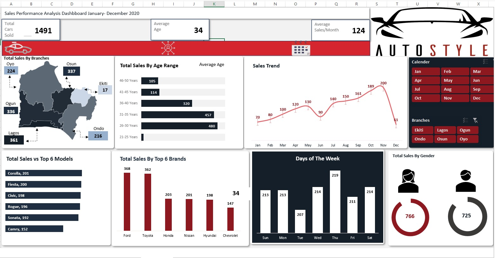

<!--Section 1: Introduce your self-->
## ABOUT ME

Hi there! I'm Akande Kabir Oluwaseun 🤓, I'm currently learning data analysis using statistical tools, and data visualization to uncover insights, optimize processes, and drive informed business decisions.

<!--Section 2: List 3-4 key projects-->
## MY PORTFOLIO 

*A glimpse of some of the projects I've been working on.*

**Preformance Analysis Dataset Of Cars Sales Between 6 Regions in Nigeria.**

**Preformance Analysis Dataset Of Cars Sales Between 6 Regions in Nigeria.**

**Attrition Analysis**

In this course, you will learn how to analyze HR and employee data, including demographics, job roles, performance metrics, and workplace satisfaction, to identify the underlying causes and predictors of employee attrition.

## CONTACT DETAILS

*Let’s connect and see how we can make a difference together!*
<table>
  <tbody>
    <tr>
      <td>📧</td>
      <td><a href="mailto:oakseun2021@gmail.com">anietieetuk@gmail.com</a></td>
    </tr>
    <tr>
      <td>ğŸ“</td>
      <td>(234) 812-911-8572</td>
    </tr>
    <tr>
      <td>ğŸ“</td>
      <td>LG, Nigeria</td>
    </tr>
    <tr>
      
      
      

   

